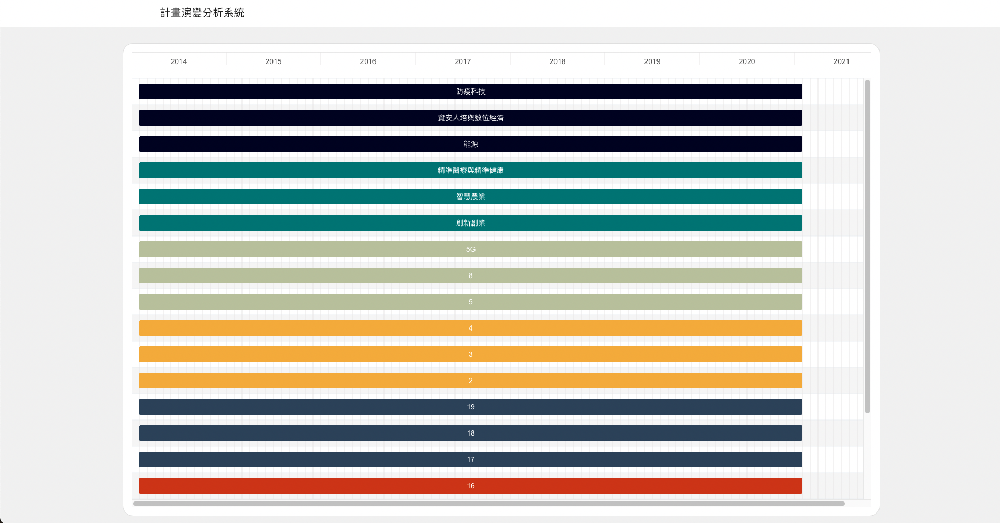

# Project Evolution Analysis System, PEA Sys
## illustration

# Getting Started with Create React App
This project was bootstrapped with [Create React App](https://github.com/facebook/create-react-app).

## Available Scripts

In the project directory, you can run:

### `npm start`

Runs the app in the development mode.\
Open [http://localhost:3000](http://localhost:3000) to view it in the browser.

The page will reload if you make edits.\
You will also see any lint errors in the console.

### `npm test`

Launches the test runner in the interactive watch mode.\
See the section about [running tests](https://facebook.github.io/create-react-app/docs/running-tests) for more information.

### `npm run build`

Builds the app for production to the `build` folder.\
It correctly bundles React in production mode and optimizes the build for the best performance.

The build is minified and the filenames include the hashes.\
Your app is ready to be deployed!

See the section about [deployment](https://facebook.github.io/create-react-app/docs/deployment) for more information.


## Handle Data
- 甘特圖所需資料，請在cmd使用以下指令將資料轉成json格式方便讀取
```sh
python src/data/handler.py
```
- 如果需讀取的檔案不同，請修改handler.py的內容
```python
if __name__ == '__main__':
    cleanAndSaveJsonWithOrder('revise_length_10.csv')
    cleanAndSaveJsonWithOrder('revise_length_20.csv')    
    cleanAndSaveJsonWithOrder('revise_length_30.csv')
    cleanAndSaveJsonWithOrder('revise_length_40.csv')
    cleanAndSaveJsonWithOrder('revise_length_50.csv')
    # cleanAndSaveJsonWithOrder('<csvfile_you_want_to_read>')
```

## Deploy
```
git reset --hard origin
git pull
npm run build
cp -r ./build/* ~/../../var/www/html
```